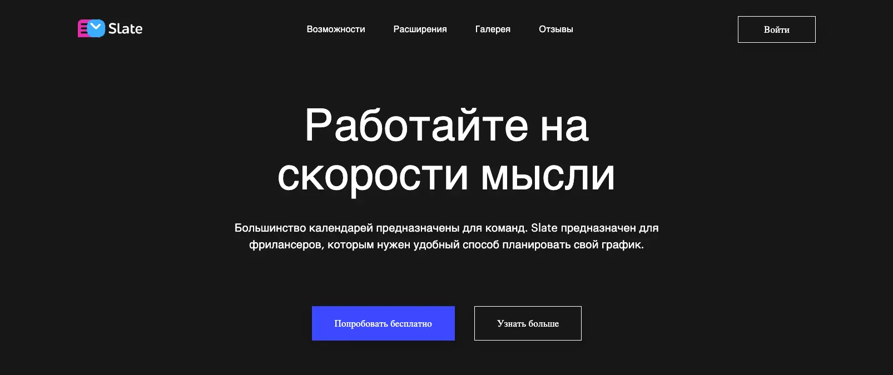

# Slate

Most calendars are prepared for the team. Slate is for freelancers who want a convenient way to manage their schedule. Deploy you can check [here](https://slate-8ohg.vercel.app/).

## Preview of the project


Link to Figma layout is [here](https://www.figma.com/file/pPwbl0gxRex1fTmgcOZQMi/Slate?type=design&node-id=0-3519&mode=design&t=yH2GxxgJ7uSbbRV4-0).

---

### Technologies Used

1. BEM notation
2. HTML, CSS
3. Docker

Slate simple landing page.

---

### Formatting rules

We use Prettier for formatting our text. See more about our configuration [here](https://frontgr.github.io/docs/prettierrc/prettierrc/).

---

### How to run Docker

You should clone the repository, install Docker and run this command in the same directory:

```bash
docker-compose up --build
```

You can read more about Docker [here](https://frontgr.github.io/docs/docker/docker/).
-
---

Project has [MIT License](https://github.com/frontgr/slate/blob/main/LICENSE).
